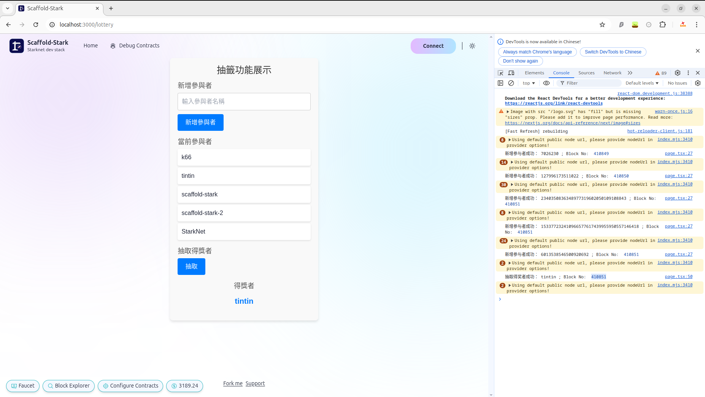
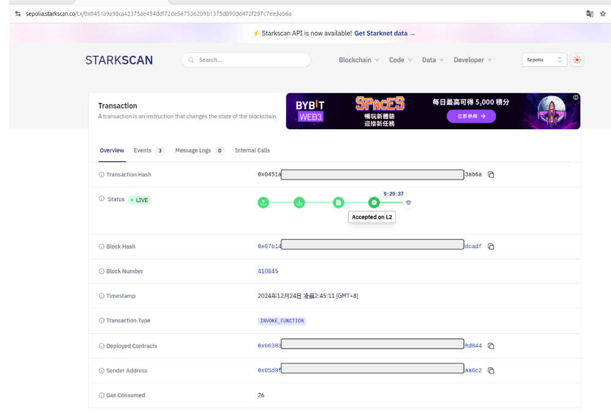
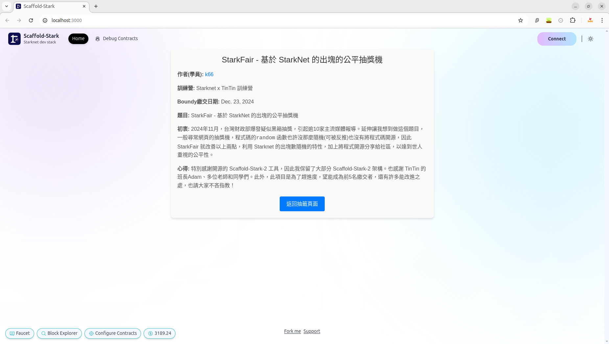
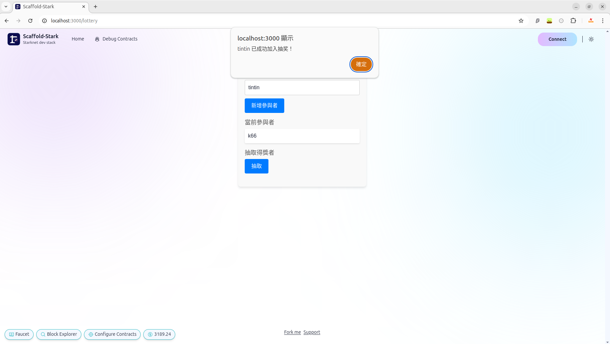
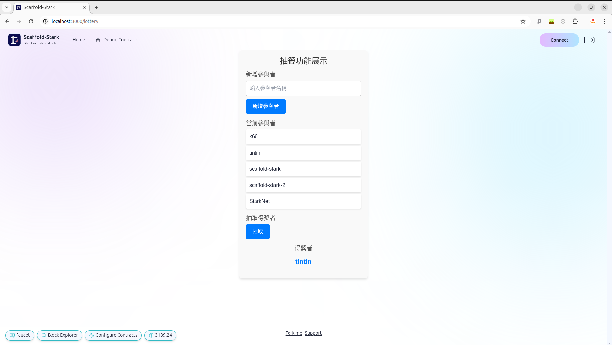
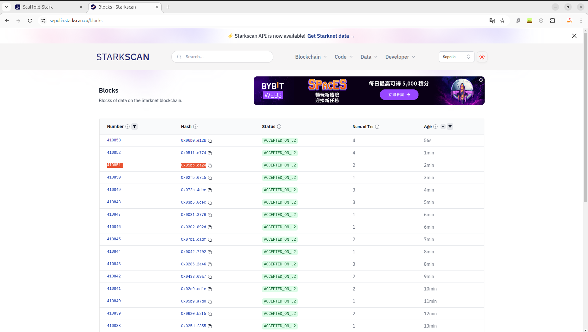
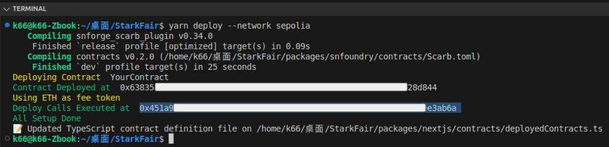

<h1 align="center"> StarkFair - 基於 StarkNet 的出塊的公平抽獎機 </h1>

🎉 此項目獲得StarkNet Scaffold-Stark賽道第三名🥉！
<h4 align="center"> based on Scaffold-Stark-2 </h4>

 

📖 Installation see 安裝教學請見 [scaffold-stark-2](https://github.com/Scaffold-Stark/scaffold-stark-2) or see [My video我的影片](https://youtu.be/Ij6CGBif1h8)

🎬 Demo see 請見 [StarkNet X TinTinLand](https://www.youtube.com/watch?v=s6ivogCJl3s&list=PLCv99tqIzSwla8xCYNF8vkyVaqhGQ9sq3&index=18)

# Introduction

  Hi我是k66，這項目是我參加`Starknet x TinTin 訓練營`的小品。初衷是今年2024年11月，台灣財政部爆發疑似黑箱抽獎，引起逾10家主流媒體報導。延伸讓我想到做這個題目，一般尋常網頁的抽獎機，程式碼的random 函數也許沒那麼隨機(可被反推)也沒有將程式碼開源，因此 `StarkFair` 就改善以上兩點，利用 `Starknet` 的出塊數隨機的特性，加上將程式開源分享給社區，以達到世人重視的公平性。

心得: 特別感謝開源的 `Scaffold-Stark-2` 工具，因此我保留了大部分 `Scaffold-Stark-2` 架構。也感謝 TinTin 的班長Adam、多位老師和同學們。雖然此項目是為了趕成為前5名繳交者，但我仍希望在下一個項目(預計是dojo)完成後，回過頭來精進這個項目或更研讀`Scaffold-Stark-2`，歡迎技術交流，也請大家不吝指教！

  
# Demo
  + 實際運行畫面 Screenshots

    
  
  + 原理簡介：已知區塊鏈的出塊速度無法確定，利用此特性，導入至中獎因子，實現隨機達成公平。
  至網頁>檢查>本智能合約設計時考慮過網站被前端攻擊，即使被攻擊也不會影響失去公平，因為出塊數的設計。
  
    
    

# v2 優化 (2026/04)

初版實作有兩個結構性漏洞：
1. **開獎計算全在前端**：`drawWinner` 只是瀏覽器裡的 `blockNumber % participants.length`，名單也只存在 React state，等於沒上鏈。任何人打開 DevTools 都能改名單或改邏輯。
2. **合約 `draw_winner(seed)` 讓呼叫者自選 seed**：即使走合約，呼叫者也能反覆試 seed 直到中意的結果。

v2 改用 OpenZeppelin Cairo (`openzeppelin_access::ownable::OwnableComponent`) + commit-reveal 流程修復：

- **Ownable**：只有 owner 能截止報名、承諾開獎、重置回合。
- **Commit-reveal with future block hash**：
  1. 報名階段：任何人都能 `add_participant(name)`，合約鏈上存名單與去重。
  2. `close_and_commit(blocks_until_entropy)`：owner 承諾一個「未來」區塊 `entropy_block = current + delay`；此時誰也無法知道該區塊的 hash。
  3. `draw_winner()`：待 `current >= entropy_block + 10`（Starknet 規定的 block hash 可查最小深度），任何人皆可開獎；合約用 `get_block_hash_syscall(entropy_block)` 加上 `round_id`、`participants_count` 過 poseidon hash 求得得獎索引。owner 事先無法預知、呼叫者也無法挑 seed。
- **Round ID**：重置時把 `round_id + 1`，O(1) 作廢舊名單，避免 gas-heavy 清 map。
- **事件**：`ParticipantAdded / RegistrationClosed / WinnerDrawn / RoundReset` 讓前端與 explorer 可追蹤。
- **前端**：`packages/nextjs/app/lottery/page.tsx` 全面改用 `useScaffoldWriteContract` / `useScaffoldReadContract`，名單與得獎者一律由鏈上讀取，瀏覽器無法再干擾結果。

## v2 驗證紀錄

在 Ubuntu 24.04 (WSL2) 上以下版本驗證通過：

- **scarb 2.9.2** (user-space install)
- **starknet-foundry 0.38.3** — 原 `.tool-versions` 的 0.34.0 因 `snforge_scarb_plugin v0.34.0` 的 transitive deps 在新版 Rust 編不過，改用 0.38.3（插件已修）。`Scarb.toml` 的 `snforge_std` 也一併升到 0.38.3。
- **Rust 1.90.0** (透過 `RUSTUP_TOOLCHAIN=1.90.0` 環境變數；1.87 版本太舊，1.95 有 ICE bug)
- **Node.js 18 / Yarn 3.2.3**

**測試結果**：

| 目標 | 指令 | 結果 |
|---|---|---|
| Cairo 合約 build | `scarb build` | ✅ |
| Cairo 單元測試 | `snforge test` | ✅ 9/9 passed |
| TypeScript 型別 | `yarn next:check-types` | ✅ 0 errors |
| 前端單元測試 | `vitest run` | ✅ 135/135 passed (10 skipped) |

  + 佈署合約成功(以sepolia測試網為例)
  
    
  
  + 可至starkscan查詢

    

# Contact
  [k66](https://k66.ninja)

