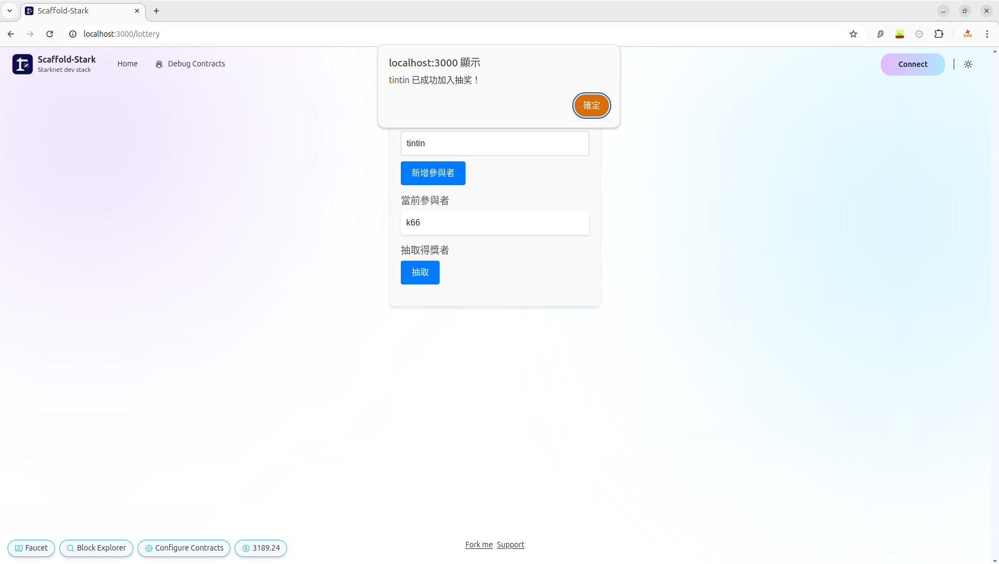

<h1 align="center"> StarkFair - 基於 StarkNet 的出塊的公平抽獎機 </h1>

🎉 此項目獲得StarkNet Scaffold-Stark賽道第三名🥉！
<h4 align="center"> based on Scaffold-Stark-2 </h4>

 

📖 Installation see 安裝教學請見 [scaffold-stark-2](https://github.com/Scaffold-Stark/scaffold-stark-2) or see [My video我的影片](https://youtu.be/Ij6CGBif1h8)

🎬 Demo see 請見 [StarkNet X TinTinLand](https://www.youtube.com/watch?v=s6ivogCJl3s&list=PLCv99tqIzSwla8xCYNF8vkyVaqhGQ9sq3&index=18)

# Introduction

  Hi我是k66，這項目是我參加`Starknet x TinTin 訓練營`的小品。初衷是今年2024年11月，台灣財政部爆發疑似黑箱抽獎，引起逾10家主流媒體報導。延伸讓我想到做這個題目，一般尋常網頁的抽獎機，程式碼的random 函數也許沒那麼隨機(可被反推)也沒有將程式碼開源，因此 `StarkFair` 就改善以上兩點，利用 `Starknet` 的出塊數隨機的特性，加上將程式開源分享給社區，以達到世人重視的公平性。

心得: 特別感謝開源的 `Scaffold-Stark-2` 工具，因此我保留了大部分 `Scaffold-Stark-2` 架構。也感謝 TinTin 的班長Adam、多位老師和同學們。雖然此項目是為了趕成為前5名繳交者，但我仍希望在下一個項目(預計是dojo)完成後，回過頭來精進這個項目或更研讀`Scaffold-Stark-2`，歡迎技術交流，也請大家不吝指教！

  
# Demo
  + 實際運行畫面 Screenshots

    
  
  + 原理簡介：已知區塊鏈的出塊速度無法確定，利用此特性，導入至中獎因子，實現隨機達成公平。
  至網頁>檢查>本智能合約設計時考慮過網站被前端攻擊，即使被攻擊也不會影響失去公平，因為出塊數的設計。
  
    
    

  + 佈署合約成功(以sepolia測試網為例)
  
    
  
  + 可至starkscan查詢

    

# Contact
  [k66](https://k66.ninja)

